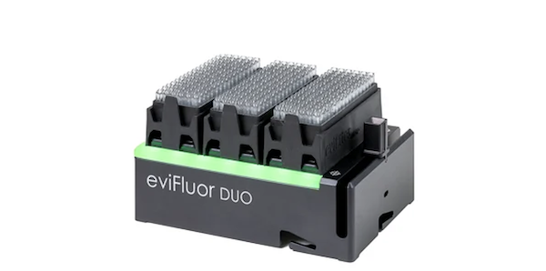
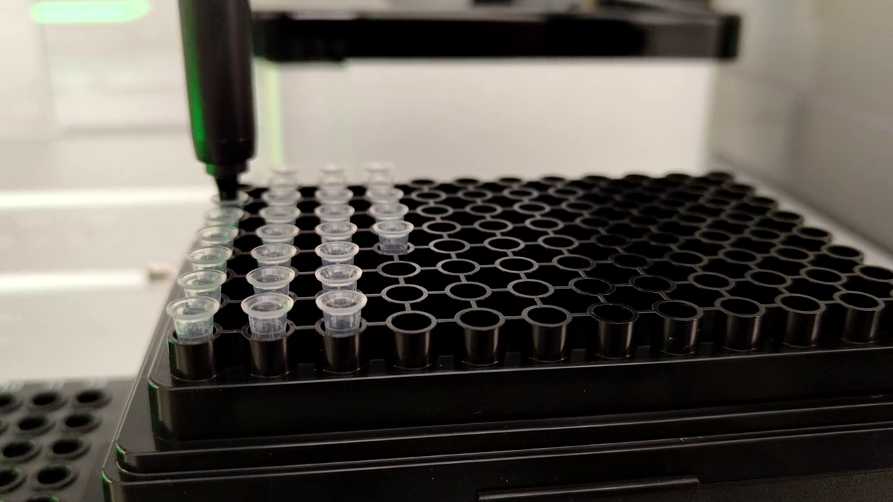

# eviFluor Duo Fluorometer User Manual

## 0. Pre-Release Status

This software is currently a pre-release version.
It is not yet a final release and may still change in behavior, interfaces, documentation, and supported workflows.

## 1. Introduction



The eviFluor Duo Fluorometer is a compact fluorescence-based fluorometer for liquid handlers.
For more information see https://www.hseag.com/on-deck-fluorometer.
To control the eviFluor Duo Fluorometer, HSE AG provides software interfaces in C, Python or C#.

### 1.1 Purpose of This Manual

This manual describes how to use the eviFluor Duo Fluorometer software interfaces from an integrator perspective.
It focuses on practical handling and separates language-independent concepts from language-specific usage.

### 1.2 Supported Software Interfaces

The eviFluor Duo Fluorometer software stack provides three interface groups:

- Source code in [C#](./doc/csharp.md) and [Python](./doc/python.md), for applications that require full control over device communication, measurement sequencing, data handling, and integration logic.
- Command line tools in [C](./doc/c-cli.md) and [Python](./doc/python-cli.md), for scripting, automation, and operational workflows without writing a custom application.
- A Python-based [REST API server](./doc/python-rest.md), for controlling the eviFluor Duo Fluorometer from external software over HTTP.

### 1.3 Liquid Handler Integrations

The eviFluor software interfaces are intended to be integrated into liquid-handler-specific workflows.
To keep these integrations maintainable, the robot-specific motion logic should be separated from the fluorometer control logic so that multiple liquid handler platforms can be documented and supported consistently.

Available integration guides:

- [Opentrons OT-2 integration](./doc/liquid-handler-ot2.md)

### 1.4 Typical Measurement Workflow

The workflow below is limited to fluorescence measurement and assumes that sample and reagents were mixed in a preceding step. For reference, a typical preparation uses Qubit 1X dsDNA High Sensitivity (HS) Assay Kit with a sample to working solution ratio of 2:38 (2 µl of sample + 38 µl of working solution). Follow the assay kit manufacturer guidelines on storage and incubation times.

A typical workflow for the fluorescence measurement is as follows:  


1. Prepare a microtiter plate that contains the required standards and sample wells.
2. The liquid handler picks up a tip and aspirates at least 10 µl sample from the selected well.
3. The liquid handler picks up a cuvette from the cuvette rack placed on top of the eviFluor Duo with the tip and moves above the cuvette guide.
4. The liquid handler checks that the cuvette guide is empty.
5. The liquid handler starts the required measurement sequence with the selected software interface.
6. The liquid handler moves the cuvette into the cuvette guide.
8. The liquid handler starts the air measurement, except no_air is True. 
9. The liquid handler dispenses 10 µl sample into the cuvette and starts the sample measurement.
10. The liquid handler moves out of the cuvette guide and discards the tip together with the cuvette.

For typical example implementations see
  - [Python Low-Level API](doc/python-low-level.md#3-complete-low-level-example)
  - [Python High-Level API](doc/python-high-level.md#3-typical-high-level-example)
  - [Python Command Line Interface](doc/python-cli.md#7-typical-examples)
  - [Python REST API](doc/python-rest.md#7-example-workflow)
  - [C Command Line Interface](doc/c-cli.md#9-typical-examples)
  - [C# Low-Level API](doc/csharp-low-level.md#3-complete-low-level-example)
  - [C# High-Level API](doc/csharp-high-level.md#3-typical-high-level-example)
  
Two typical software workflows are supported:

1. Workflow with air measurement
2. Workflow without air measurement (`no_air=True`)

The workflow with air measurement uses one air measurement and one sample measurement for each stored measurement after the initial setup.
The typical sequence is:

1. measure empty cuvette (air)
2. measure cuvette with sample
3. repeat air / sample for all following standards and samples

The workflow without air measurement omits the separate air step after initialization.
The typical sequence is:

1. measure cuvette with sample
2. repeat the sample measurement for all following standards and samples

The `no_air=True` workflow is especially useful for multi-channel pipettes or other workflows where a separate air measurement per channel would add unnecessary handling effort.
In such setups, the sample-only workflow reduces the number of measurement steps and can simplify synchronized operation across multiple pipetting channels.

The measurement order must always be:

1. standard high
2. standard low
3. samples 1-n

The standard high measurement must come first because the detector performs an automatic gain adjustment during the initial setup.
Starting with the high standard ensures that the gain is adjusted so that the standard high reaches approximately 80% of the maximum detector response.

See a video of a simple workflow on an Opentrons OT-2 Robot:
[](https://hseag.github.io/evifluor/pre-release/doc/images/evifluor-workflow.mp4)

## 2. CAD

The following CAD views provide a starting point for mechanical integration of the eviFluor Duo Fluorometer.

[Side View](./doc/images/evifluor-cad-side.png)

Use this view to understand the side profile, overall height, and the vertical relationship between the device body and the cuvette guide area.

[Top View Calibration](./doc/images/evifluor-cad-top-calibration.png)

Use this view to understand the top-side geometry relevant for calibration and positioning in relation to the surrounding system.

[Top View Detail](./doc/images/evifluor-cad-top-detail.png)

Use this view to inspect the detailed top-side geometry, including the area around the cuvette guide and nearby mechanical constraints.

### 2.1 Calibration

For calibration, one of the defined calibration references in the CAD should be used as the reference position.

### 2.2 Cuvette Pickup

The cuvette should be picked up with the pipette tip.
The cuvette holding force must be at least 8 N.

### 2.3 Cuvette Insertion

The liquid handler should first move the cuvette above the cuvette guide.
After that, the liquid handler should move the cuvette 30.0 mm into the cuvette guide.

For teaching the insertion height, it is recommended to use the cuvette guide bottom position as the mechanical reference.
In practice, the target position can be taught as 1 mm above the cuvette guide bottom position.

As a geometric reference, the lower edge of the cuvette is approximately 26.0 mm above the work deck at the end position.

## 3. Simulation

For development, automated tests, and workflow validation without physical hardware, an eviFluor simulator is available.

See [Simulation Guide](./doc/simulation.md) for setup, startup commands, control options, and examples for using the simulator with the Python interfaces.

## 4. Troubleshooting

### Device not found

If the software cannot detect the device, verify that the USB connection is present and stable.
Also make sure that no other application is currently using the same device.

### Empty check or baseline fails

If the empty check or baseline step fails, verify manually that no cuvette is inserted and that the cuvette guide is free of residual liquid or contamination.

### Measurement values are unstable

If repeated measurements show unexpected variation, verify that the cuvette is positioned consistently, that the sample volume is appropriate, and that no air bubbles are present in the liquid.

### Unexpected measurement results

If calculated or reported values do not match expectations, verify that standards and samples were processed in the intended order and that the first air and first sample measurements were performed correctly.

## 5. Appendix

### 5.1 JSON data file format

All interface implementations produce a JSON data file with the same general structure.
This common file format is used to store measurement runs in a consistent way, independent of whether the data was generated by the C command line interface, the C# interfaces, or the Python interfaces.

The JSON data file is intended for:

- persistent storage of measurement results
- later review and traceability
- post-processing and result calculation
- CSV export
- regression tests and automated comparisons

The file typically contains:

- device information
- measurement parameters
- optional adjustment or calibration information
- one or more stored measurements
- optional calculated results for each measurement
- optional comments, timestamps, and logging information

A measurement entry typically contains the air and sample values relevant for the eviFluor Duo Fluorometer workflow.
If results have already been calculated, the corresponding result values are stored together with the raw measurement data.
The calculated result block contains the concentration and, if available, the RFU value used as input for the concentration fit.
In the eviFluor context, RFU is the measured signal voltage in mV after subtracting the `dark` values and the `std_low` baseline contribution already included in the selected workflow.
The typical RFU range is 0 to 2500 mV.

Typical top-level fields:

- `info`: device metadata and API version
- `measurements`: list of stored measurements

Typical measurement entry fields:

- `air`: air measurement values
- `sample`: sample measurement values
- `comment`: optional user comment
- `date_time`: timestamp
- `results`: optional calculated result values
- `logging`: optional device log messages

Typical `results` fields:

- `concentration`: calculated concentration in the unit of the selected standard high
- `rfu`: corrected signal voltage in mV used for concentration fitting; `dark` and `std_low` are already subtracted

Example:

```json
{
  "info": {
    "date": "2026-04-23T15:08:40.123456",
    "product": "eviFluor",
    "production_number": "P10006",
    "serial_number": "SN5002",
    "firmware_version": "9.9.9",
    "comment": "example run",
    "api": "1.2.3"
  },
  "measurements": [
    {
      "air": {
        "dark": 8.087,
        "value": 100.784,
        "ledPower": 224
      },
      "sample": {
        "dark": 7.935,
        "value": 100.327,
        "ledPower": 224.0
      },
      "comment": "Sample@A1",
      "date_time": "2026-04-23T15:08:50.380421",
      "logging": [
        "1672447 SLP1 * power=40",
        "1672461 MEAS +",
        "1674929 MEAS - dark1=8.087159 value1=100.784314 ledPower1=224"
      ],
      "errors": [
        {
          "problem_id": 5,
          "description": "AUTO_GAIN_RESULT",
          "data": {
            "found": false,
            "led_power": 224
          }
        }
      ],
      "results": {
        "concentration": 10.0,
        "rfu": 1885.0761086956522
      }
    }
  ]
}
```

The exact JSON content may differ slightly depending on the workflow and interface, but the overall structure is intended to remain compatible across all supported implementations.
