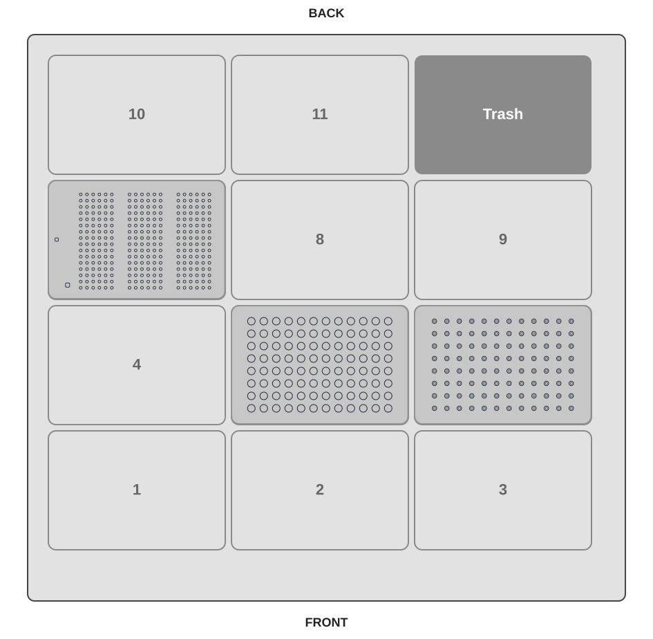

# eviFluor Duo Fluorometer OT-2 Device Demo

This guide describes how to run [`evifluor_ot2_device_demo.py`](https://hseag.github.io/evifluor/integration_kits/opentrons-ot2/protocol/evifluor_ot2_device_demo.py){ download="evifluor_ot2_device_demo.py" } on an
Opentrons OT-2. The protocol demonstrates the eviFluor Duo Fluorometer device-control sequence:
aspirating liquid from a sample plate, picking up a cuvette, moving it into the
measurement guide, running the eviFluor Duo Fluorometer measurement, and returning the liquid
to the source well.

It is an integration demonstration only. It does not prepare an assay, apply a
dilution factor, or implement a validated measurement workflow.

## Prerequisites

- Opentrons OT-2 with a P20 single-channel pipette on the left mount
- One full `opentrons_96_filtertiprack_20ul` rack
- One `corning_96_wellplate_360ul_flat` sample plate with source liquids
- The custom eviFluor Duo Fluorometer labware [`hse_evifluor_pilot_left_20ul_tip_v2.json`](https://hseag.github.io/evifluor/integration_kits/opentrons-ot2/labware/hse_evifluor_pilot_left_20ul_tip_v2.json){ download="hse_evifluor_pilot_left_20ul_tip_v2.json" }
- The eviFluor Duo Fluorometer device and its OT-2 runtime integration for a real run
- One prepared eviFluor Duo Fluorometer cuvette for every configured measurement

Simulate the protocol in the Opentrons App before a real run. Confirm the
installed eviFluor Duo Fluorometer runtime, kit, cuvette handling, and target-device setup.

## Run Parameters

| Parameter | Default | Allowed range | Description |
| --- | ---: | ---: | --- |
| `nr_of_std_high` | 1 | 1 to 4 | Number of high-standard positions at the start of the selected well range |
| `nr_of_std_low` | 1 | 1 to 4 | Number of low-standard positions after the high standards |
| `number_of_samples` | 1 | 1 to 94 | Number of sample positions after the standards |
| `mtp_start_well` | `A1` | `A1` to `H12` | First source well in Opentrons well order |
| `concentration_high` | 10 ng/uL | 1 to 4000 ng/uL | High-standard concentration passed to the eviFluor Duo Fluorometer runtime |
| `settling_time` | 5 s | 0 to 60 s | Settling-time override passed to the eviFluor Duo Fluorometer runtime |
| `kit` | `Default` | Configured choices | eviFluor Duo Fluorometer kit used by the runtime |
| `pause_on_error` | `false` | `false` or `true` | Pause if eviFluor Duo Fluorometer reports an error or warning |

The total number of high standards, low standards, and samples must be at most
96. The selected range starting at `mtp_start_well` must fit on the sample
plate. The source wells follow the Opentrons order A1 through H1, then A2
through H2, and so on.

## Deck Layout

| Slot | Labware | Contents |
| --- | --- | --- |
| 5 | `corning_96_wellplate_360ul_flat` | Source plate: high standards, low standards, and samples |
| 6 | `opentrons_96_filtertiprack_20ul` | Fresh P20 filter tips; `nr_of_std_high + nr_of_std_low + number_of_samples` tips (maximum 96) |
| 7 | `hse_evifluor_pilot_left_20ul_tip_v2` | eviFluor Duo Fluorometer cuvettes and measurement guide |

All other usable deck slots are empty. Slot 7 is reserved for the eviFluor Duo Fluorometer
labware.

## Source Plate Layout

Starting at `mtp_start_well`, load the consecutive source wells in this order:

1. `nr_of_std_high` high-standard wells.
2. `nr_of_std_low` low-standard wells.
3. `number_of_samples` sample wells.

For example, with `mtp_start_well = A1`, one high standard, one low standard,
and one sample are in A1, B1, and C1 respectively. Each measured position
needs sufficient liquid for a 12 uL aspiration and return transfer.

## Procedure

1. Confirm that the P20 is installed on the left mount and that the deck
   layout matches this guide.
2. Configure the standards, samples, `mtp_start_well`, kit, and settling time.
3. Load the source liquids in consecutive wells on the sample plate in slot 5.
4. Load a full P20 tip rack in slot 6.
5. Load the custom eviFluor Duo Fluorometer labware and prepared cuvettes in slot 7.
6. Run a simulation in the Opentrons App.
7. For a real run, verify the eviFluor Duo Fluorometer integration and start the protocol.
8. Review the OT-2 run log and the eviFluor Duo Fluorometer-exported results.

## Device-Control Sequence

For each configured position, the protocol picks up a fresh tip, aspirates
12 uL from the source well, picks up a cuvette, moves it through the eviFluor Duo Fluorometer
measurement guide, calls the eviFluor Duo Fluorometer runtime, returns the liquid to the source
well, and drops the tip.

## Implementation Details

This demo is also a reference implementation for the OT-2/eviFluor Duo Fluorometer device
integration. The following details help when adapting its device-control
sequence to another protocol.

### Custom Labware Positions

The custom eviFluor Duo Fluorometer labware uses these positions:

- The calibration reference is at `A1`.
- Cuvettes in rack position I use `A2-P2` through `A7-P7`.
- Cuvettes in rack position II use `A8-P8` through `A13-P13`.
- Cuvettes in rack position III use `A14-P14` through `A19-P19`.
- The cuvette guide is at `A20`.

The protocol starts cuvette selection at `wells()[1]`, so it skips
`wells()[0]`, the calibration reference at `A1`. It uses `A20` as the guide
for the movement into and out of the eviFluor Duo Fluorometer measurement position.

### Simulation and Hardware Execution

The `if not protocol.is_simulating()` checks are essential: the Opentrons
simulator validates the deck layout, labware access, and robot movements, but
cannot simulate the connected eviFluor Duo Fluorometer.

The checks exclude hardware-dependent operations from simulation, including:

- importing and creating the `evifluor.Run` object;
- checking whether the cuvette holder is empty;
- starting measurements on the connected device; and
- exporting result data as CSV.

On the physical OT-2, these operations communicate with the eviFluor Duo Fluorometer device
and write result files. During simulation, the protocol still validates the
pipetting flow and robot movement, without requiring a connected device.

## Important Notes

- Prepare one fresh tip and one eviFluor Duo Fluorometer cuvette per configured position.
- The protocol starts its cuvette selection at the second well of the custom
  eviFluor Duo Fluorometer labware. Follow the released eviFluor Duo Fluorometer method for actual cuvette
  preparation and placement.
- The demo calls the eviFluor Duo Fluorometer runtime only during non-simulated runs.
- Do not treat results from this demonstration as validated assay results
  without a released method and the required verification work.
