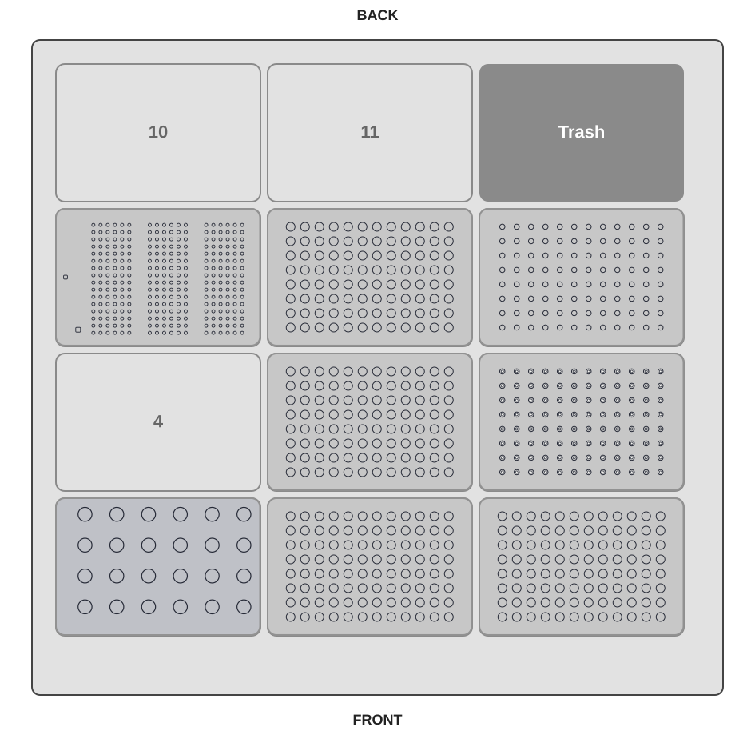

# OT-2 DNA Normalization

This guide describes how to run [`evifluor_ot2_dna_normalization.py`](https://hseag.github.io/evifluor/integration_kits/opentrons-ot2/protocol/evifluor_ot2_dna_normalization.py){ download="evifluor_ot2_dna_normalization.py" } on
an Opentrons OT-2. The protocol measures 1 to 24 DNA samples with eviFluor Duo Fluorometer,
calculates a target concentration, and prepares valid normalized samples in
the NORM plate.

Each source sample is diluted 1:10 before assay preparation. Measured assay
concentrations are multiplied by 10 to calculate the original SAMPLE
concentration.

## Prerequisites

- Opentrons OT-2 with a P20 single-channel pipette on the left mount
- Compatible 20 uL filter tips and one empty 20 uL filter-tip rack for parking
- Eppendorf Safe-Lock 1.5 mL tubes in an Opentrons 24-tube rack
- Four empty or prepared 96-well PCR plates for SAMPLE, DILUTED, MIX, and NORM
- The custom eviFluor Duo Fluorometer labware [`hse_evifluor_pilot_left_20ul_tip_v2.json`](https://hseag.github.io/evifluor/integration_kits/opentrons-ot2/labware/hse_evifluor_pilot_left_20ul_tip_v2.json){ download="hse_evifluor_pilot_left_20ul_tip_v2.json" }
- eviFluor Duo Fluorometer device and its OT-2 runtime integration for a real run
- DNA samples, dilution diluent, normalization diluent, working solution, and standards

Simulate the protocol in the Opentrons App and verify labware, pipetting
parameters, and eviFluor Duo Fluorometer integration before running it on the robot.

## Run Parameters

| Parameter | Default | Allowed range | Description |
| --- | ---: | ---: | --- |
| `n_samples` | 1 | 1 to 24 | Number of populated SAMPLE wells |
| `mtp_start_well` | `A1` | `A1` to `H12` | First PCR plate well |
| `v_sample_available` | 40 uL | 20 to 60 uL | Available source-sample volume in every populated SAMPLE well |
| `c_target` | 10 ng/uL | 0 to 20 ng/uL | Target concentration; `0` calculates the highest common valid target |
| `v_end` | 30 uL | 10 to 60 uL | Final volume in each NORM well |
| `pause_on_error` | `false` | `false` or `true` | Pause the OT-2 if eviFluor Duo Fluorometer reports an error or warning |

The protocol processes `n_samples` consecutive wells starting at `mtp_start_well`.
Wells follow the Opentrons order A1 through H1, then A2 through H2, then A3
through H3. The selected start well and `n_samples` must fit on the plate.
SAMPLE, DILUTED, MIX, and NORM use the same selected wells.
`N_MEASUREMENTS_PER_STANDARD` is a protocol constant and is currently set to
`2`.

When `c_target` is `0` and no valid common target can be calculated, the
protocol marks every sample as invalid, exports the result CSV, and performs
no normalization transfers.

## Deck Layout

| Slot | Labware | Contents |
| --- | --- | --- |
| 1 | `opentrons_24_tuberack_eppendorf_1.5ml_safelock_snapcap` | Diluents, working solution, standards, and standard assays |
| 2 | `opentrons_96_wellplate_200ul_pcr_full_skirt` | SAMPLE plate with source DNA samples |
| 3 | `opentrons_96_wellplate_200ul_pcr_full_skirt` | Empty NORM plate |
| 5 | `opentrons_96_wellplate_200ul_pcr_full_skirt` | Empty DILUTED plate |
| 6 | `opentrons_96_filtertiprack_20ul` | Fresh P20 filter tips; at least `2 x n_samples + 7` tips |
| 7 | `hse_evifluor_pilot_left_20ul_tip_v2` | eviFluor Duo Fluorometer cuvettes and measurement guide |
| 8 | `opentrons_96_wellplate_200ul_pcr_full_skirt` | Empty MIX plate |
| 9 | `opentrons_96_filtertiprack_20ul` | Empty P20 filter-tip rack; at least `n_samples + 2` empty parking positions |

Load the tube rack in slot 1 as follows:

| Rack position | Tube | Minimum loaded volume |
| --- | --- | ---: |
| A1 | Dilution diluent | `20 + 18 x n_samples` uL |
| B1 | Normalization diluent | `20 + n_samples x (v_end - 2)` uL |
| C1 | Working solution | `20 + 38 x (n_samples + 2)` uL |
| A2 | Standard high source | 22 uL |
| B2 | Standard low source | 22 uL |
| A3 | Standard high assay | Empty |
| B3 | Standard low assay | Empty |

The minimum volumes include the 20 uL tube dead-volume / safety margin. The
normalization-diluent value is the maximum required amount and ensures enough
liquid even if every sample needs the largest permitted diluent volume. A2 and
B2 each provide 2 uL standard plus the 20 uL margin; A3 and B3 must be empty
before the run.

## Plate Layout

The SAMPLE, DILUTED, MIX, and NORM plates share the same well order. For every
processed sample, fill the corresponding SAMPLE well and leave the matching
DILUTED, MIX, and NORM wells empty before the run.

| Location | Per-sample volume after preparation |
| --- | ---: |
| DILUTED | 20 uL: 18 uL diluent + 2 uL source sample |
| MIX | 40 uL: 38 uL working solution + 2 uL diluted sample |
| A3, B3 | 40 uL: 38 uL working solution + 2 uL standard |
| NORM | `v_end` uL: calculated source-sample volume + calculated normalization-diluent volume |

## Protocol Steps

| Step | Action | Result |
| --- | --- | --- |
| 1 | Pre-fill DILUTED with 18 uL diluent per sample | DILUTED wells are ready |
| 2 | Pre-fill MIX and A3/B3 with 38 uL working solution | Assay wells and standard-assay tubes are ready |
| 3 | With one tip, transfer 2 uL SAMPLE to DILUTED and mix; transfer 2 uL DILUTED to MIX, mix, and park the same tip | 40 uL fluorescence assay per sample |
| 4 | Transfer 2 uL A2 to A3 and 2 uL B2 to B3, mix, and park each tip | High and low standard assays |
| 5 | Incubate for 120 seconds | Assays are ready for measurement |
| 6 | Measure each standard twice: first with its parked tip, then with a new tip and a new cuvette | Four eviFluor Duo Fluorometer calibration measurements |
| 7 | Reuse each parked sample tip to measure its MIX well | One measurement per sample |
| 8 | Back-calculate original concentration and validate normalization volumes | Valid and invalid normalization plans |
| 9 | Transfer normalization diluent, then source sample, into each valid NORM well and mix | Normalized DNA samples |

## Liquid Handling and Tips

The P20 transfers no more than 19 uL per pipetting action. Larger volumes are
split into equal sub-transfers. Aspiration from Safe-Lock tubes uses the
configured liquid-level-tracked tube profile.

The fresh tip rack must contain at least `2 x n_samples + 7` tips. The empty
parking rack in slot 9 must provide at least `n_samples + 2` positions: one
for every sample assay and one for each standard assay. Each sample-specific
tip is used for the dilution and assay preparation, then parked and reused
only for its corresponding measurement. The first measurement of each
standard uses its parked tip; the repeat measurement uses a new fresh tip and
a new eviFluor Duo Fluorometer cuvette. At 24 samples, prepare 28 cuvettes.

## Procedure

1. Verify that pipette, labware, eviFluor Duo Fluorometer device, and deck layout match this guide.
2. Set the run parameters, including `mtp_start_well`. Use the smallest actual available source volume for `v_sample_available`.
3. Load A1, B1, C1, A2, and B2 with at least the calculated volumes. Leave A3 and B3 empty.
4. Place the SAMPLE plate in slot 2; place empty NORM, DILUTED, and MIX plates in slots 3, 5, and 8.
5. Place fresh P20 tips in slot 6 and an empty parking tip rack in slot 9.
6. Load the custom eviFluor Duo Fluorometer labware in slot 7 and prepare its cuvettes according to the released eviFluor Duo Fluorometer method.
7. Load the protocol in the Opentrons App and run a simulation first.
8. After a successful simulation, start the run and review the run log and exported results.

## Results

For non-simulated runs, the protocol writes eviFluor Duo Fluorometer data to the configured
run directory and creates a semicolon-delimited
`<eviFluor-run-name>-normalization.csv` file. It includes the source well,
measured sample concentration, selected target concentration, calculated
sample and diluent volumes, and validation status for every sample.

Samples are skipped when their calculated volumes are outside the protocol
limits, their required source volume exceeds `v_sample_available`, or their
measurement is unavailable or outside the configured measurement range.

## Important Notes

- The high-standard calibration setting supplied to eviFluor Duo Fluorometer remains 10 ng/uL. Confirm this and the released eviFluor Duo Fluorometer method before validated use.
- The protocol uses A3 and B3 as prepared standard-assay tubes. Do not use these positions for other liquids.
- The parking rack in slot 9 must start empty; it is deliberately not registered as a fresh tip rack.
- Validate liquid levels, tube profile, labware, tip reuse, cuvette handling, and result export on the target OT-2 before using this protocol for validated work.
