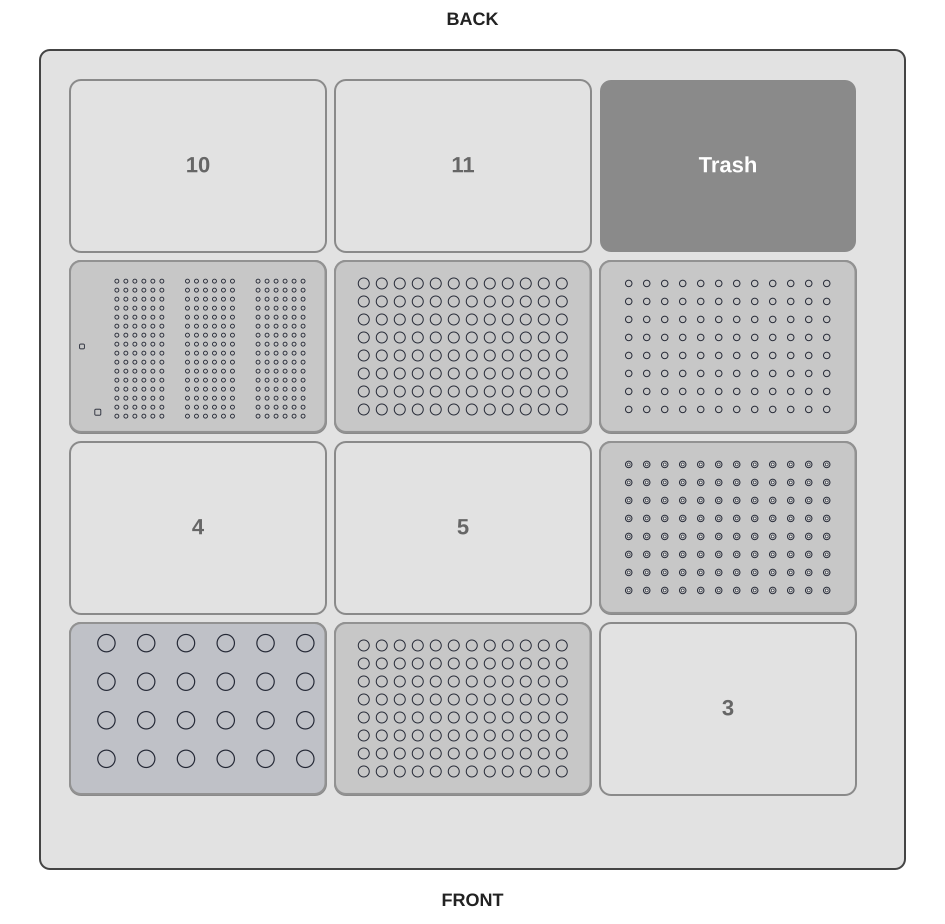

# OT-2 DNA Test Sample Measurement (Undiluted)

This guide describes how to run
[`evifluor_ot2_dna_sample_measurement_undiluted.py`](https://hseag.github.io/evifluor/pre-release/integration_kits/opentrons-ot2/protocol/evifluor_ot2_dna_sample_measurement_undiluted.py){ download="evifluor_ot2_dna_sample_measurement_undiluted.py" } on an Opentrons OT-2.
The protocol measures 1 to 24 DNA samples with eviFluor Duo Fluorometer and reports each
measured sample concentration.

Each sample is transferred directly from SAMPLE to MIX for assay preparation.
The reported result is the measured assay concentration without a dilution
factor.

## Prerequisites

- Opentrons OT-2 with a P20 single-channel pipette on the left mount
- Compatible 20 uL filter tips
- An empty 20 uL filter-tip rack for parking sample-specific tips
- Eppendorf Safe-Lock 1.5 mL tubes in an Opentrons 24-tube rack
- Two 96-well PCR plates for SAMPLE and MIX
- The custom eviFluor Duo Fluorometer labware [`hse_evifluor_pilot_left_20ul_tip_v2.json`](https://hseag.github.io/evifluor/pre-release/integration_kits/opentrons-ot2/labware/hse_evifluor_pilot_left_20ul_tip_v2.json){ download="hse_evifluor_pilot_left_20ul_tip_v2.json" }
- eviFluor Duo Fluorometer device and its OT-2 runtime integration available for a real run
- Normalized DNA samples in the SAMPLE plate; at least 10 uL in every selected well
- Working solution and high and low eviFluor Duo Fluorometer standards

Simulate the protocol in the Opentrons App and verify the labware,
liquid-handling parameters, and eviFluor Duo Fluorometer integration before running it on the
robot.

## Run Parameters

| Parameter | Default | Allowed range | Description |
| --- | ---: | ---: | --- |
| `n_samples` | 1 | 1 to 24 | Number of normalized samples in the SAMPLE plate |
| `mtp_start_well` | `A1` | `A1` to `H12` | First PCR plate well |
| `pause_on_error` | `false` | `false` or `true` | Pause the OT-2 if eviFluor Duo Fluorometer reports an error or warning |

The protocol processes `n_samples` consecutive wells starting at `mtp_start_well`.
Wells follow the Opentrons order A1 through H1, then A2 through H2, then A3
through H3. The selected start well and `n_samples` must fit on the plate.
SAMPLE and MIX use the same selected wells.
`N_MEASUREMENTS_PER_STANDARD` is a protocol constant and is currently set to
`2`.

## Deck Layout

| Slot | Labware | Contents |
| --- | --- | --- |
| 1 | `opentrons_24_tuberack_eppendorf_1.5ml_safelock_snapcap` | Working solution, standards, and standard assays |
| 2 | `opentrons_96_wellplate_200ul_pcr_full_skirt` | SAMPLE plate with normalized DNA samples; at least 10 uL per selected well |
| 6 | `opentrons_96_filtertiprack_20ul` | Fresh P20 filter tips; at least `n_samples + 5` tips |
| 7 | `hse_evifluor_pilot_left_20ul_tip_v2` | eviFluor Duo Fluorometer cuvettes and measurement guide |
| 8 | `opentrons_96_wellplate_200ul_pcr_full_skirt` | Empty MIX plate |
| 9 | `opentrons_96_filtertiprack_20ul` | Empty P20 filter-tip rack; at least `n_samples + 2` empty parking positions |

Load the tube rack in slot 1 as follows:

| Rack position | Tube | Minimum loaded volume |
| --- | --- | ---: |
| C1 | Working solution | `20 + 38 x (n_samples + 2)` uL |
| A2 | Standard high source | 22 uL |
| B2 | Standard low source | 22 uL |
| A3 | Standard high assay | Empty |
| B3 | Standard low assay | Empty |

The minimum volume for C1 includes the protocol's 20 uL tube dead-volume /
safety margin. For example, with 24 samples load at least 1008 uL working
solution. A2 and B2 each provide 2 uL standard plus the 20 uL margin; A3 and
B3 must be empty before the run. A1 remains unused.

The concentration and preparation of the high and low standards must match
the released eviFluor Duo Fluorometer method. The protocol's current high-standard setting is
10 ng/uL; verify it before validation or routine use.

## Plate Layout

The SAMPLE and MIX plates use the same well order. For every sample processed,
load at least 10 uL DNA sample in the corresponding SAMPLE well and leave the
corresponding MIX well empty before the run. The protocol aspirates 2 uL at
1 mm above the SAMPLE-well bottom.

| Plate | Per-sample volume after preparation |
| --- | ---: |
| MIX | 40 uL: 38 uL working solution + 2 uL sample |
| A3, B3 | 40 uL: 38 uL working solution + 2 uL standard |

## Protocol Steps

| Step | Action | Result |
| --- | --- | --- |
| 1 | Pre-fill MIX plate and A3/B3 with 38 uL working solution | MIX wells and standard-assay tubes are ready |
| 2 | Transfer 2 uL from SAMPLE to MIX, mix, and park each tip | 40 uL fluorescence assay per sample |
| 3 | Transfer 2 uL from A2 to A3 and from B2 to B3, mix, and park each tip | Two 40 uL standard assays |
| 4 | Incubate for 120 seconds | Assays are ready for measurement |
| 5 | Measure each standard twice: first with its parked tip, then with a new tip and a new cuvette | Four eviFluor Duo Fluorometer calibration measurements |
| 6 | Reuse each parked sample tip to load 15 uL from MIX into a cuvette and measure | One measurement per sample |
| 7 | Report each measured value without a dilution correction | Reported concentration of the SAMPLE well |

The protocol loads 15 uL into each cuvette for a measurement. Cuvette pickup
and measurement movements are controlled by the custom eviFluor Duo Fluorometer labware and
the installed eviFluor Duo Fluorometer runtime.

## Liquid Handling and Tips

The P20 transfers no more than 19 uL per pipetting action. Larger volumes are
split into equal sub-transfers. Aspiration from 1.5 mL Safe-Lock tubes uses the
configured tube profile for liquid-level-tracked positioning.

The fresh tip rack must contain at least `n_samples + 5` tips. The empty
tip rack in slot 9 must provide at least `n_samples + 2` empty positions for
parking. One dedicated tip is parked per sample during assay preparation and
reused only for that sample's subsequent cuvette loading. Two further tips are
parked after preparing the high and low standards and reused only for their
respective first standard measurement. The repeat measurement of each standard
uses a new fresh tip and a new eviFluor Duo Fluorometer cuvette. At 24 samples, prepare 28
cuvettes.

## Procedure

1. Verify that the pipette, labware, eviFluor Duo Fluorometer device, and deck layout match this guide.
2. Set `n_samples` and `mtp_start_well` for the populated SAMPLE wells.
3. Load the required tube volumes into C1, A2, and B2. Leave A3 and B3 empty; A1 remains unused.
4. Place the SAMPLE plate in slot 2 and an empty MIX plate in slot 8.
5. Place fresh P20 tips in slot 6 and an empty parking tip rack in slot 9.
6. Load the custom eviFluor Duo Fluorometer labware in slot 7 and prepare its cuvettes according to the released eviFluor Duo Fluorometer method.
7. Load the protocol in the Opentrons App and run a simulation first.
8. After a successful simulation, start the run and review the run log and exported results.

## Results

For non-simulated runs, the protocol writes eviFluor Duo Fluorometer data to the configured
eviFluor Duo Fluorometer run directory and exports an additional semicolon-delimited CSV file
named `<eviFluor-run-name>-measurement.csv`. It contains these columns:

| Column | Description |
| --- | --- |
| `sample_index` | Sequential sample number, starting at 1 |
| `well` | SAMPLE plate source well |
| `Csample_ng_ul` | Back-calculated concentration in ng/uL |

## Important Notes

- The protocol only verifies that `n_samples` is between 1 and 24. Load at least 10 uL in every corresponding SAMPLE well before the run; the protocol aspirates 2 uL at 1 mm above the well bottom and does not verify source volume automatically.
- MIX plate wells must be empty in the wells being processed.
- The parking tip rack in slot 9 must start empty; it is deliberately not registered as a fresh tip rack.
- The protocol's eviFluor Duo Fluorometer integration values are marked as demo values in the source. Confirm the kit, standard concentration, settling time, and measurement method against the released method before use.
- Validate liquid levels, tube profile, labware, tip reuse, cuvette handling, and result export on the target OT-2 before using this protocol for validated work.
