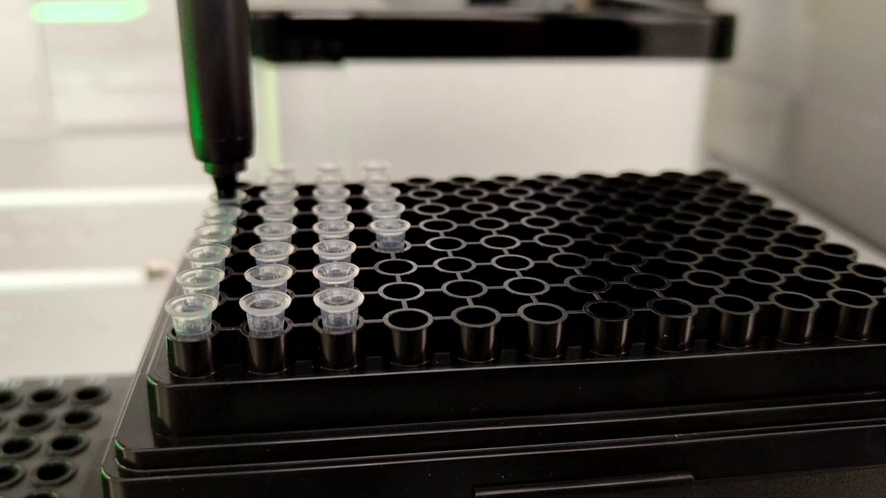

# eviFluor Duo Fluorometer at a Glance

The eviFluor Duo Fluorometer is a compact fluorometer for automated fluorescence measurements on liquid handling platforms. A key application is the fluorescence-based quantification of nucleic acid concentrations. The instrument integrates into automated workflows in which the liquid handler prepares and transfers the sample, while the eviFluor Duo Fluorometer performs the fluorescence measurement and returns the resulting data for subsequent processing. 

The instrument is intended for general laboratory use and research applications. It is not designed, nor classified, as an in-vitro diagnostic device (IVD) and must not be used for in-vitro diagnostic testing.

For more information see [https://www.hseag.com/on-deck-fluorometer](https://www.hseag.com/on-deck-fluorometer).

This documentation provides the information and resources required to integrate the eviFluor Duo Fluorometer into a liquid handling platform, as well as the latest instrument firmware and API software versions for download.

!!! warning "Pre-release software"
    The software is currently pre-release. Behavior, interfaces, documentation, and supported workflows may change before the final release.

## See It in Action

The following video demonstrates a simple eviFluor Duo Fluorometer workflow on an Opentrons OT-2 liquid handler.

## What is eviFluor Duo Fluorometer?

The eviFluor Duo Fluorometer measures prepared standards and samples as part of an automated liquid handling workflow. It enables fluorescence measurements to be integrated directly into the workflow, allowing samples to be measured without leaving the liquid handling platform. The instrument can be controlled through an API, allowing measuring steps to be incorporated into automated liquid handling protocols. The eviFluor Duo Fluorometer does not require a separate user interface for routine operation.

eviFluor Duo Fluorometer measures prepared standards and samples in an automated workflow. It is especially useful when fluorescence measurement should be added to a liquid handler process without turning the liquid handler itself into a custom measurement instrument.

For an overview of how the eviFluor Duo Fluorometer fits into an automated laboratory workflow, see [Workflow](applications-workflow.md).
