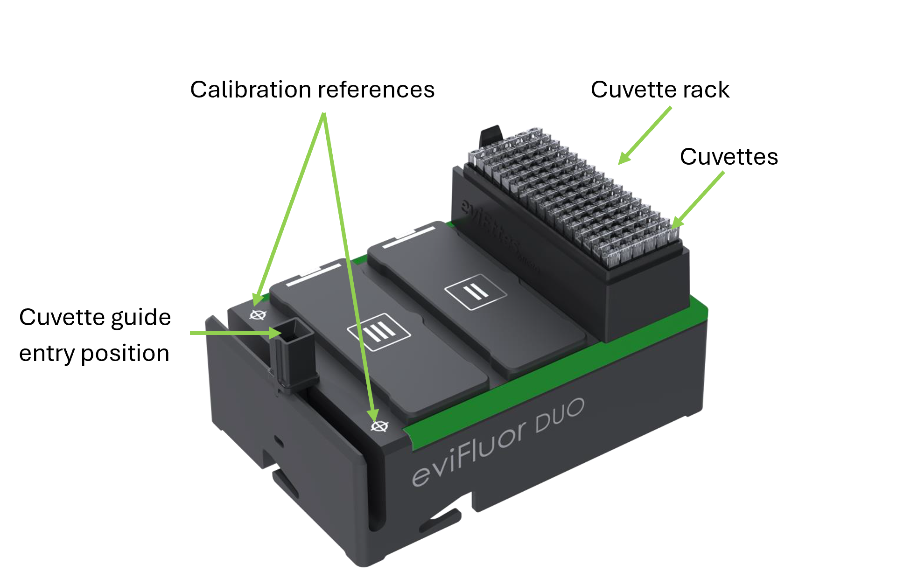

# Positioning and Teaching

Correct positioning and teaching are required for reliable cuvette handling.

## What Needs to Be Taught

The required positions typically include: 

- cuvette pickup from the cuvette rack
- movement to the eviFluor Duo
- cuvette insertion into the eviFluor Duo
- cuvette discard after measurement

## Engineering Starting Points

The following values provide initial guidance for teaching and validating cuvette handling:

- Cuvette holding force: the connection between the pipette tip and the cuvette should provide a holding force of at least 8 N to ensure that the cuvette remains securely attached during movement and insertion
- Insertion travel: From the defined cuvette guide entry position, the cuvette is moved 30.0 mm into the cuvette guide. See [CAD Reference](#cad-reference).
- Insertion position: The final insertion position into the cuvette guide is taught relative to the bottom of the cuvette guide. A clearance of approximately 1 mm above the guide bottom is typically used

These values should be used as starting points for integration. The final taught positions and movements must be verified on the target liquid handler.

## CAD Reference

Use the CAD views below when defining the mechanical reference positions and clearances for an integration:

- [Side view](images/evifluor-cad-side.png): overall height and the vertical relationship between the instrument body and the cuvette guide.
- [Top view, calibration](images/evifluor-cad-top-calibration.png): calibration reference geometry and top-side positioning.
- [Top view, detail](images/evifluor-cad-top-detail.png): detailed geometry around the cuvette guide and nearby mechanical constraints.

## Validation Advice

Before using assay liquids, validate the taught positions and cuvette handling:

- verify reliable cuvette pickup from the rack 
- verify repeatable movement to and insertion into the cuvette guide 
- verify reliable cuvette removal and discard 
- repeat the complete motion sequence to confirm consistent operation
