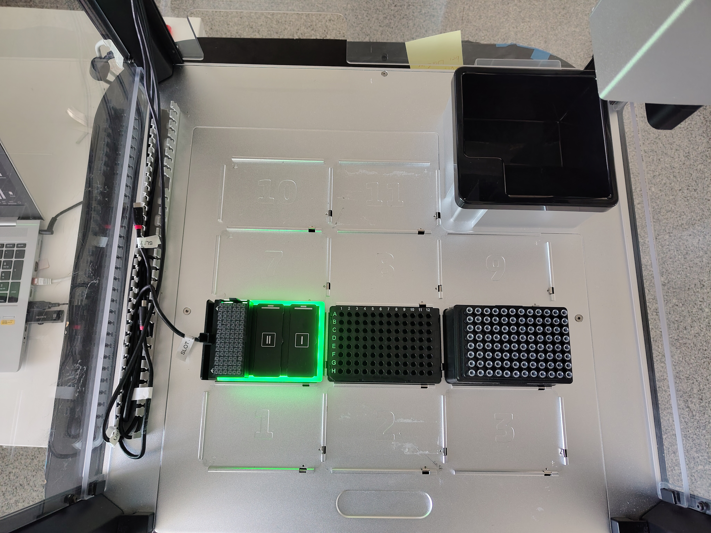

# Opentrons OT-2 Liquid Handler Integration

## 1. Introduction

This document describes a practical starting point for integrating the eviFluor Duo Fluorometer Python software with an Opentrons OT-2 liquid handler.

## 2. Prerequisites

On the [Opentrons OT-2](https://opentrons.com/robots/ot-2), a [Single-Channel Pipette P20](https://opentrons.com/products/single-channel-electronic-pipette-p20) must be mounted on the left side.

## 3. Installation

### 3.1 Software Setup

1. [SSH](https://support.opentrons.com/en/articles/3287453-connecting-to-your-ot-2-with-ssh) into the OT-2.
2. Install the Python package with:

```bash
python -m pip install https://hseag.github.io/evi-test/pre-release/python/dist/hse_evifluor-0.12.0rc1-py3-none-any.whl
```

If the OT-2 has no internet connection, copy the Python wheel to the device with:

```bash
scp -i ot2_ssh_key hse_evifluor-0.12.0rc1-py3-none-any.whl root@YOUR_IP:
```

Then install it locally on the OT-2 with:

```bash
python -m pip install hse_evifluor-0.12.0rc1-py3-none-any.whl
```

After the installation, restart the OT-2.

### 3.2 Hardware Setup

1. Connect the eviFluor Duo Fluorometer to the OT-2 with the USB cable.
2. Place the eviFluor Duo Fluorometer on deck slot 4.
3. Add a cuvette rack on slot III on the instrument.
4. Wait until the device power-on self-test is complete and the instrument is ready.
5. Place a compatible `Corning 96 Well Plate 360 uL Flat` on deck slot 5.
6. Place an `Opentrons OT-2 96 Filter Tip Rack 20 uL` on deck slot 6.

The samples on the plate must be prepared in this order:

1. standard high
2. standard low
3. samples

The standard high wells must start at `A1`, followed directly by the standard low wells, followed directly by the sample wells.



### 3.3 Labware and Protocol

Install the custom labware [hse_evifluor_pilot_left_20ul_tip_v2.json](../integration_kits/opentrons-ot2/labware/hse_evifluor_pilot_left_20ul_tip_v2.json) and the protocol [evifluor_demo_v4.py](../integration_kits/opentrons-ot2/protocol/evifluor_demo_v4.py) in the Opentrons App.

The demo protocol uses the following deck layout:

1. Slot 4: eviFluor Duo Fluorometer with `hse_evifluor_pilot_left_20ul_tip_v1`
2. Slot 5: `corning_96_wellplate_360ul_flat`
3. Slot 6: `opentrons_96_filtertiprack_20ul`
4. Left mount: `p20_single_gen2`

The protocol provides the following run parameters in the Opentrons App:

1. `nr_of_std_high`: number of standard high measurements at the beginning of the plate, default `1`, allowed range `1..4`.
2. `nr_of_std_low`: number of standard low measurements directly after the high standards, default `1`, allowed range `1..4`.
3. `number_of_samples`: number of sample measurements directly after the standards, default `1`, allowed range `1..94`.
4. `concentration_high`: concentration assigned to the standard high, default `10.0`, allowed range `1..4000`.
5. `settling_time`: settling time override in seconds, default `5.0`, allowed range `0..60`.
6. `kit`: eviFluor kit used for result calculation and timing. Supported values are `Default`, `QubitTM_1X_dsDNA_High_Sensitivity_HS`, and `QubitTM_1X_dsDNA_Broad_Range_BR`.
7. `pause_on_error`: pauses the protocol if the eviFluor Duo Fluorometer reports an error or warning.

The sum of `nr_of_std_high`, `nr_of_std_low`, and `number_of_samples` must not exceed `96`.

## 4. Starting The Protocol

Before running the protocol for the first time, it is recommended to perform the [Labware Position Check](https://docs.opentrons.com/ot-2/calibration/labware-offsets/).

After the protocol has finished, the result files can be accessed through [Jupyter](https://support.opentrons.com/s/article/Running-the-robot-using-Jupyter-Notebook) in the directory `runs/evifluor`.

## 5. Detailed Explanation

The custom labware uses the following positions:

- The calibration cross is located at position `A1`.
- Cuvettes in rack position I use `A2-P2` through `A7-P7`.
- Cuvettes in rack position II use `A8-P8` through `A13-P13`.
- Cuvettes in rack position III use `A14-P14` through `A19-P19`.
- The cuvette guide is located at position `A20`.

When accessing the cuvettes with [wells()](https://docs.opentrons.com/python-api/reference/labware/#opentrons.protocol_api.Labware.wells), indexing starts at `1`, because `wells()[0]` is the calibration reference at `A1`.

The repeated `if not protocol.is_simulating()` checks are required because the Opentrons simulator can validate deck layout, labware access, and robot motion, but it cannot simulate the connected eviFluor Duo Fluorometer.

Without these checks, the protocol would try to execute hardware-dependent operations during simulation, for example:

- creating an `evifluor.Run` object
- checking whether the cuvette holder is empty
- starting measurement steps on the connected device
- exporting result data as CSV

These operations only work on a real OT-2 with a connected eviFluor Duo Fluorometer. In simulation mode, they would fail because no physical device is available.

In practice, the `is_simulating()` checks separate two execution modes:

- simulation mode: validate protocol flow, well access, and robot movement
- hardware mode: communicate with the eviFluor Duo Fluorometer, perform measurements, and store result files
